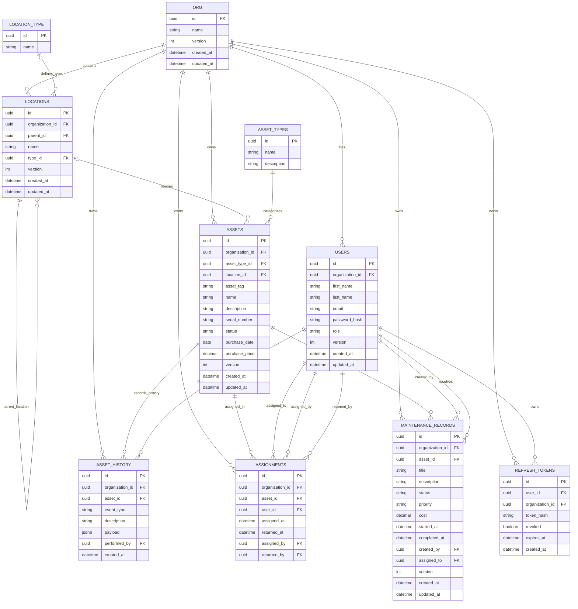

# AssetFlow

### ER diagram

```mermaid
erDiagram
    ORG {
        uuid id PK
        string name
        int version
        datetime created_at
        datetime updated_at
    }

    LOCATION_TYPE {
        uuid id PK
        string name
    }

    LOCATIONS {
        uuid id PK
        uuid organization_id FK
        uuid parent_id FK
        string name
        uuid type_id FK
        int version
        datetime created_at
        datetime updated_at
    }

    USERS {
        uuid id PK
        uuid organization_id FK
        string first_name
        string last_name
        string email
        string password_hash
        string role
        int version
        datetime created_at
        datetime updated_at
    }

    REFRESH_TOKENS {
        uuid id PK
        uuid user_id FK
        uuid organization_id FK
        string token_hash
        boolean revoked
        datetime expires_at
        datetime created_at
    }

    ASSET_TYPES {
        uuid id PK
        string name
        string description
    }

    ASSETS {
        uuid id PK
        uuid organization_id FK
        uuid asset_type_id FK
        uuid location_id FK
        string asset_tag
        string name
        string description
        string serial_number
        string status
        date purchase_date
        decimal purchase_price
        int version
        datetime created_at
        datetime updated_at
    }

    ASSET_HISTORY {
        uuid id PK
        uuid organization_id FK
        uuid asset_id FK
        string event_type
        string description
        jsonb payload
        uuid performed_by FK
        datetime created_at
    }

    ASSIGNMENTS {
        uuid id PK
        uuid organization_id FK
        uuid asset_id FK
        uuid user_id FK
        datetime assigned_at
        datetime returned_at
        uuid assigned_by FK
        uuid returned_by FK
    }

    MAINTENANCE_RECORDS {
        uuid id PK
        uuid organization_id FK
        uuid asset_id FK
        string title
        string description
        string status
        string priority
        decimal cost
        datetime started_at
        datetime completed_at
        uuid created_by FK
        uuid assigned_to FK
        int version
        datetime created_at
        datetime updated_at
    }

    ORG ||--o{ LOCATIONS : "contains"
    ORG ||--o{ USERS : "has"
    ORG ||--o{ ASSETS : "owns"
    ORG ||--o{ ASSIGNMENTS : "owns"
    ORG ||--o{ MAINTENANCE_RECORDS : "owns"
    ORG ||--o{ ASSET_HISTORY : "owns"
    ORG ||--o{ REFRESH_TOKENS : "owns"
    LOCATION_TYPE o|--o{ LOCATIONS : "defines_type"
    LOCATIONS ||--o{ LOCATIONS : "parent_location"
    LOCATIONS o|--o{ ASSETS : "houses"
    ASSET_TYPES ||--o{ ASSETS : "categorizes"
    ASSETS ||--o{ ASSET_HISTORY : "records_history"
    USERS ||--o{ ASSET_HISTORY : "performed_by"
    USERS ||--o{ REFRESH_TOKENS : "owns"
    ASSETS ||--o{ ASSIGNMENTS : "assigned_in"
    USERS ||--o{ ASSIGNMENTS : "assigned_to"
    USERS ||--o{ ASSIGNMENTS : "assigned_by"
    USERS ||--o{ ASSIGNMENTS : "returned_by"
    ASSETS ||--o{ MAINTENANCE_RECORDS : "has_maintenance"
    USERS ||--o{ MAINTENANCE_RECORDS : "created_by"
    USERS ||--o{ MAINTENANCE_RECORDS : "resolves"
```
