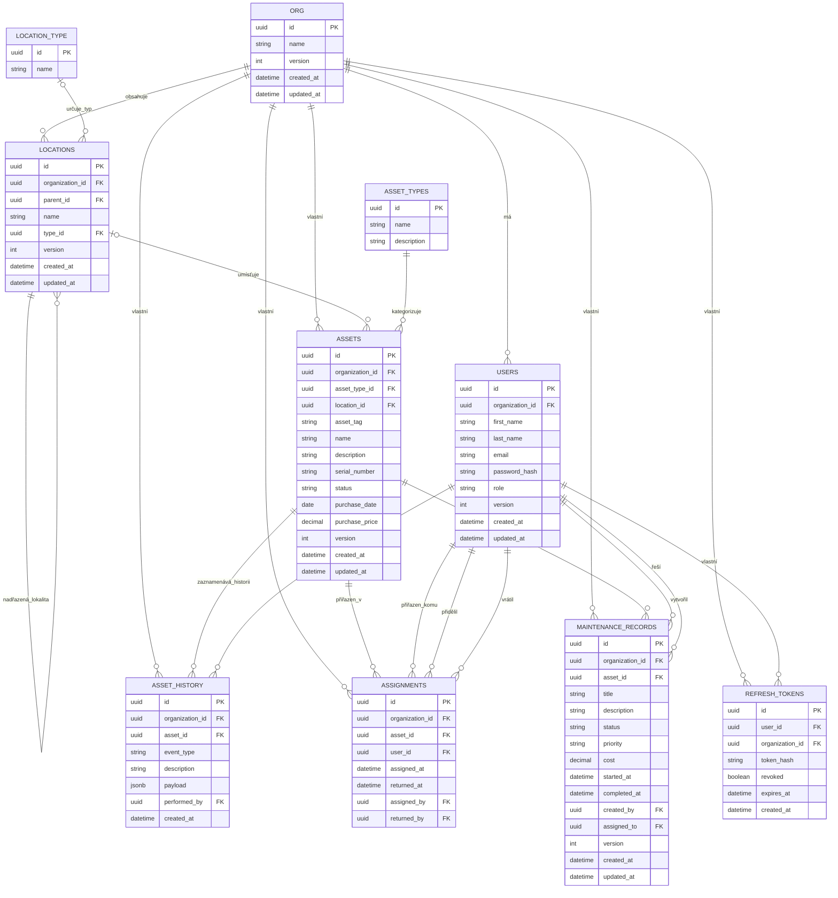

# AssetFlow

### ER diagram

```mermaid
erDiagram
    ORG {
        uuid id PK
        string name
        int version
        datetime created_at
        datetime updated_at
    }

    LOCATION_TYPE {
        uuid id PK
        string name
    }

    LOCATIONS {
        uuid id PK
        uuid organization_id FK
        uuid parent_id FK
        string name
        uuid type_id FK
        int version
        datetime created_at
        datetime updated_at
    }

    USERS {
        uuid id PK
        uuid organization_id FK
        string first_name
        string last_name
        string email
        string password_hash
        string role
        int version
        datetime created_at
        datetime updated_at
    }

    REFRESH_TOKENS {
        uuid id PK
        uuid user_id FK
        uuid organization_id FK
        string token_hash
        boolean revoked
        datetime expires_at
        datetime created_at
    }

    ASSET_TYPES {
        uuid id PK
        string name
        string description
    }

    ASSETS {
        uuid id PK
        uuid organization_id FK
        uuid asset_type_id FK
        uuid location_id FK
        string asset_tag
        string name
        string description
        string serial_number
        string status
        date purchase_date
        decimal purchase_price
        int version
        datetime created_at
        datetime updated_at
    }

    ASSET_HISTORY {
        uuid id PK
        uuid organization_id FK
        uuid asset_id FK
        string event_type
        string description
        jsonb payload
        uuid performed_by FK
        datetime created_at
    }

    ASSIGNMENTS {
        uuid id PK
        uuid organization_id FK
        uuid asset_id FK
        uuid user_id FK
        datetime assigned_at
        datetime returned_at
        uuid assigned_by FK
        uuid returned_by FK
    }

    MAINTENANCE_RECORDS {
        uuid id PK
        uuid organization_id FK
        uuid asset_id FK
        string title
        string description
        string status
        string priority
        decimal cost
        datetime started_at
        datetime completed_at
        uuid created_by FK
        uuid assigned_to FK
        int version
        datetime created_at
        datetime updated_at
    }

    ORG ||--o{ LOCATIONS : "obsahuje"
    ORG ||--o{ USERS : "má"
    ORG ||--o{ ASSETS : "vlastní"
    ORG ||--o{ ASSIGNMENTS : "vlastní"
    ORG ||--o{ MAINTENANCE_RECORDS : "vlastní"
    ORG ||--o{ ASSET_HISTORY : "vlastní"
    ORG ||--o{ REFRESH_TOKENS : "vlastní"
    LOCATION_TYPE o|--o{ LOCATIONS : "určuje_typ"
    LOCATIONS ||--o{ LOCATIONS : "nadřazená_lokalita"
    LOCATIONS o|--o{ ASSETS : "umísťuje"
    ASSET_TYPES ||--o{ ASSETS : "kategorizuje"
    ASSETS ||--o{ ASSET_HISTORY : "zaznamenává_historii"
    USERS ||--o{ ASSET_HISTORY : "provedl"
    USERS ||--o{ REFRESH_TOKENS : "vlastní"
    ASSETS ||--o{ ASSIGNMENTS : "přiřazen_v"
    USERS ||--o{ ASSIGNMENTS : "přiřazen_komu"
    USERS ||--o{ ASSIGNMENTS : "přidělil"
    USERS ||--o{ ASSIGNMENTS : "vrátil"
    ASSETS ||--o{ MAINTENANCE_RECORDS : "má_údržbu"
    USERS ||--o{ MAINTENANCE_RECORDS : "vytvořil"
    USERS ||--o{ MAINTENANCE_RECORDS : "řeší"
```
